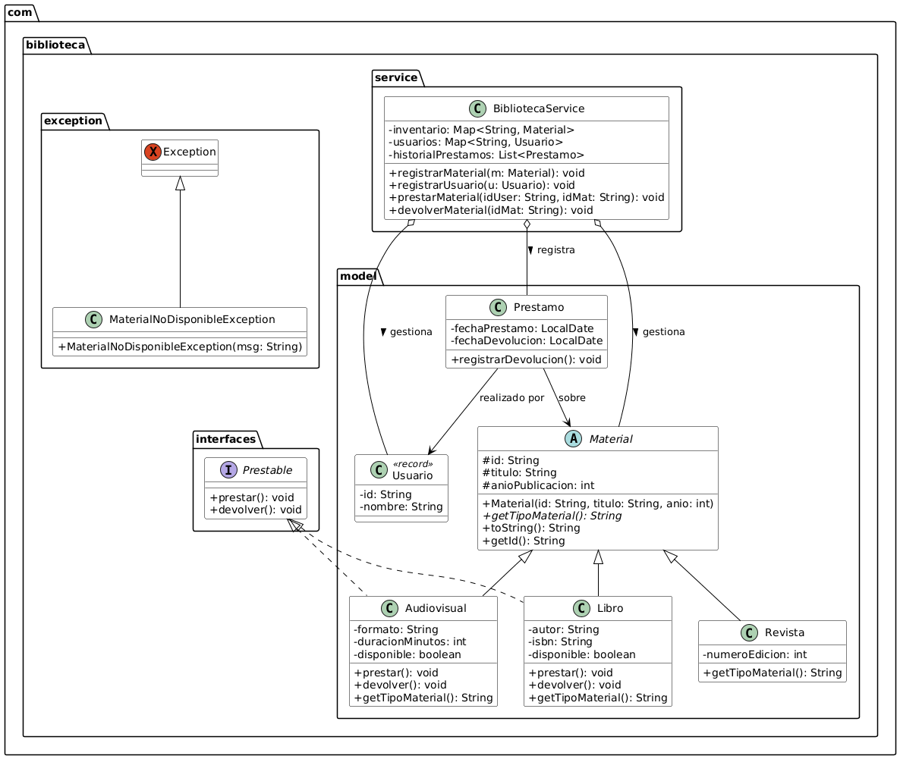
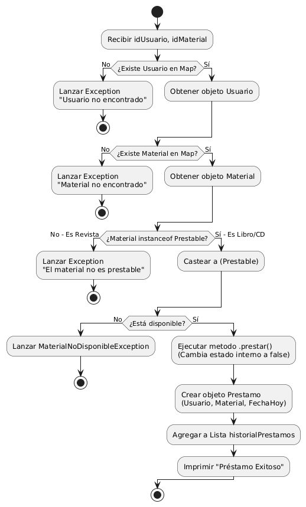

# 📚 Sistema de Gestión de Biblioteca (Java Core)

## 🧐 Descripción del proyecto

Motor de lógica de negocio (Core) desarrollado 100% en Java, diseñado para gestionar el inventario y los préstamos de una biblioteca. Este proyecto no cuenta con interfaz gráfica ni menú interactivo, ya que su propósito es servir como una API interna (Domain Model) centrada en el modelado complejo, la aplicación estricta de los principios de la Programación Orientada a Objetos (POO) y la calidad del código. A través de una arquitectura limpia basada en el estándar de la industria, el sistema gestiona reglas de negocio robustas, manejo de excepciones personalizadas y estructuras de datos eficientes para garantizar un funcionamiento seguro y escalable.

## 🎯 Objetivos del proyecto
*   **Aplicar Abstracción y Herencia:** Modelar el dominio utilizando clases base (`Material`) y entidades concretas con comportamientos específicos (`Libro`, `Revista`, `Audiovisual`).
*   **Implementar Polimorfismo e Interfaces:** Utilizar contratos (`Prestable`) para procesar préstamos dinámicamente sin acoplar el código a implementaciones concretas, evaluando tipos en tiempo de ejecución mediante `instanceof`.
*   **Optimizar el manejo de datos:** Emplear colecciones eficientes como `HashMap` para búsquedas de inventario y usuarios en tiempo **O(1)**, y `ArrayList` para el registro cronológico de historiales.
*   **Desarrollar código reutilizable:** Implementar métodos con **Genéricos (Generics)** (`<E>`, `<K, V>`) para la manipulación e impresión dinámica de diferentes tipos de Colecciones y Mapas.
*   **Garantizar la fiabilidad del software:** Desarrollar una suite de **Pruebas Unitarias con JUnit 5** aplicando el patrón AAA (Arrange, Act, Assert), logrando una cobertura completa de los "Caminos Felices" y los Casos Borde (Edge Cases).
*   **Asegurar la integridad del sistema:** Proteger la lógica de negocio mediante el uso de **Records** inmutables para el transporte de datos y la creación de **Excepciones Personalizadas** (`MaterialNoDisponibleException`, `IdDuplicadoException`, `IdNoEncontrado`) bajo el principio Fail-Fast.

## 🗺️ Diagramas del proyecto
### 👩🏻‍🏫 Diagrama de Clases (Modelo de Dominio)

### 🔄 Diagrama de Flujo (Lógica de Préstamo)

---

**Regresar al [README principal](../../README.md) 🏠**

---
## Autor
👨🏻‍💼 **[GitHub: StalkerData](https://github.com/StalkerData)**