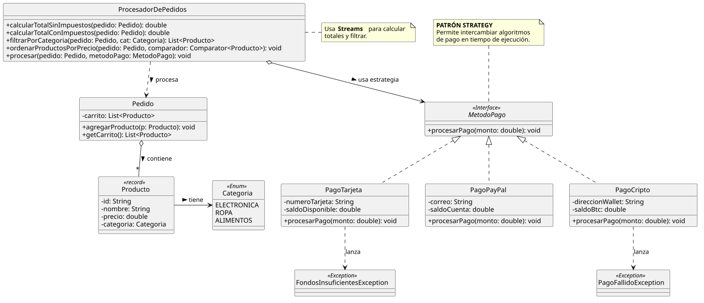
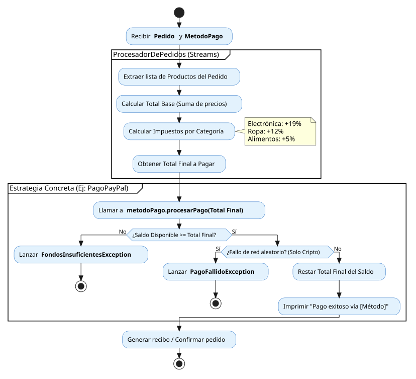

# 🛒 Procesador de Pedidos E-commerce (Java Core & Patrones de Diseño)

## Descripción del proyecto
Motor de lógica de negocio desarrollado 100% en Java para simular el procesamiento de un carrito de compras y su pasarela de pago. Este proyecto destaca por la implementación del Patrón de Diseño Strategy para lograr un desacoplamiento total en los métodos de cobro, y el uso intensivo de programación funcional (Streams y Lambdas) para el cálculo de impuestos, filtrado y ordenamiento de productos. A través de una arquitectura limpia, el sistema está preparado para escalar y añadir nuevas formas de pago sin modificar su núcleo central.

## Objetivos del proyecto
*   **Implementar el Patrón Strategy:** Desacoplar la lógica de procesamiento de pedidos de los métodos de pago concretos (`PagoTarjeta`, `PagoPayPal`, `PagoCripto`) mediante la interfaz `MetodoPago`, respetando estrictamente el principio Open/Closed de SOLID.
*   **Aplicar Programación Funcional:** Utilizar la API de Streams de Java (`.stream()`, `.mapToDouble()`, `.filter()`) para realizar cálculos matemáticos complejos (como la suma de impuestos por categoría) y filtrados de colecciones de forma declarativa y eficiente.
*   **Uso de Lambdas y Method References:** Implementar ordenamiento dinámico de colecciones pasando comportamientos como parámetros mediante `Comparator.comparing()`.
*   **Modelado Inmutable:** Utilizar `Records` en Java para modelar la entidad `Producto`, garantizando la inmutabilidad de los datos críticos (como el precio y la categoría) durante el ciclo de vida del pedido.
*   **Manejo de Excepciones de Negocio:** Crear y gestionar excepciones personalizadas (`FondosInsuficientesException`, `PagoFallidoException`) para simular validaciones reales y seguras en pasarelas de pago.
*   **Garantizar la fiabilidad del software:** Validar la precisión matemática (uso de deltas en aserciones de tipo `double`), el comportamiento de los Streams y la integración de las estrategias de pago mediante una suite robusta de pruebas unitarias con **JUnit 5**.

## Diagramas del proyecto

### Diagrama de Clases (Modelo de Dominio y Patrón Strategy)

### Diagrama de Flujo (Lógica de Procesamiento de Pago)

---

**Regresar al [Nivel 2](../README.md) 👾**

**Regresar al [Principal](../../README.md) 🏠**

---

👨🏻‍💼 **Autor** [GitHub: StalkerData](https://github.com/StalkerData)