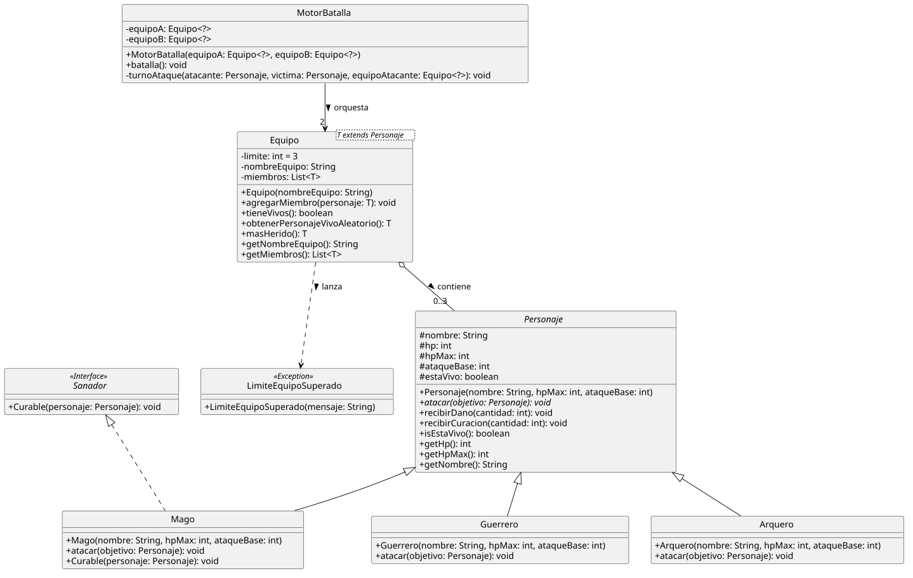
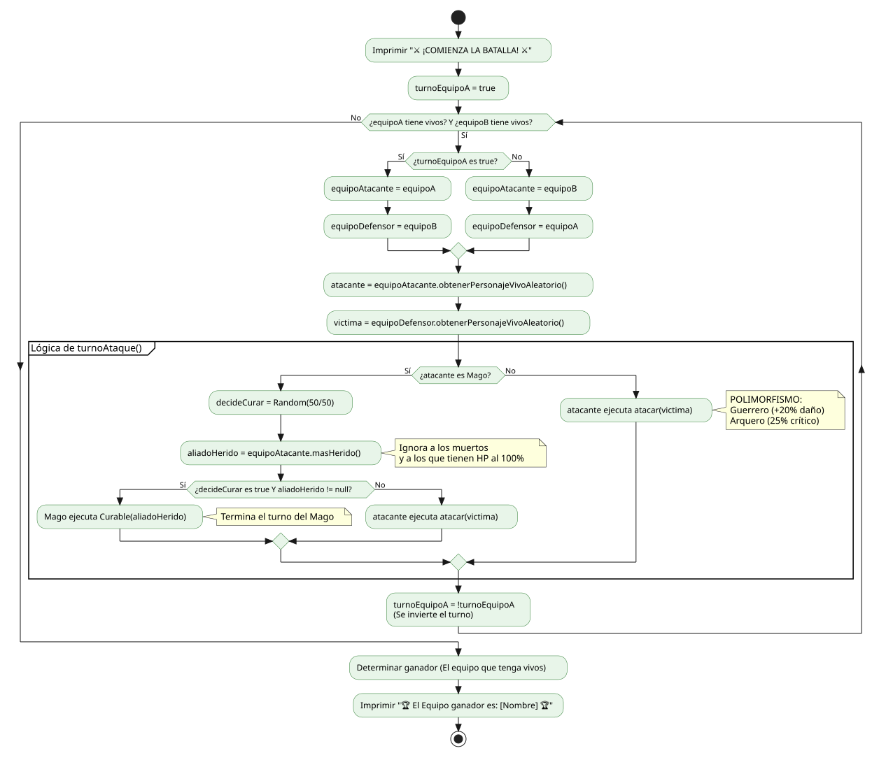

# ⚔️ Simulador de Batallas RPG (Java Core)

## 🧐 Descripción del proyecto
Motor de lógica de negocio desarrollado 100% en Java para simular batallas por turnos entre equipos de personajes. Este proyecto se centra en la aplicación avanzada de Polimorfismo, el uso de Genéricos (`<T>`) para colecciones seguras (Type Safety) y la implementación de reglas de negocio complejas. A través de una arquitectura limpia, el sistema gestiona ataques, curaciones, probabilidades matemáticas y estados de los personajes sin acoplar el motor de batalla a implementaciones concretas, garantizando un código altamente escalable y mantenible.

## 🎯 Objetivos del proyecto
*   **Aplicar Polimorfismo Puro:** Diseñar un motor de batalla que ejecute acciones (`atacar()`) desconociendo el tipo exacto del personaje, delegando la lógica matemática (daño extra, golpes críticos) a las subclases (`Guerrero`, `Arquero`, `Mago`).
*   **Implementar Genéricos (Generics):** Crear una estructura de datos segura (`Equipo<T extends Personaje>`) para garantizar la integridad de los tipos en tiempo de compilación y evitar errores de casteo en tiempo de ejecución.
*   **Manejar Interfaces y Contratos:** Utilizar la interfaz `Sanador` para definir habilidades específicas (curación) y evaluar su uso dinámicamente en el bucle de juego mediante `instanceof`.
*   **Proteger el Encapsulamiento:** Asegurar que las modificaciones de estado (reducción o aumento de HP) se realicen exclusivamente a través de métodos controlados dentro de las propias entidades, respetando los límites máximos y mínimos.
*   **Optimizar con Streams y Lambdas:** Utilizar la API de Streams de Java para filtrar personajes vivos y buscar objetivos válidos (como el aliado más herido) de manera eficiente y declarativa.
*   **Garantizar la fiabilidad del software:** Desarrollar una suite de **Pruebas Unitarias con JUnit 5** para validar cálculos matemáticos, límites de curación, cambios de estado (muerte) y el lanzamiento correcto de excepciones personalizadas (`LimiteEquipoSuperado`).

## 🗺️ Diagramas del proyecto

### 📦 Diagrama de Clases (Modelo de Dominio)

### 🔄 Diagrama de Flujo (Lógica de Batalla)

---

**Regresar al [Principal](../../README.md) 🏠**

---

👨🏻‍💼 **Autor** [GitHub: StalkerData](https://github.com/StalkerData)